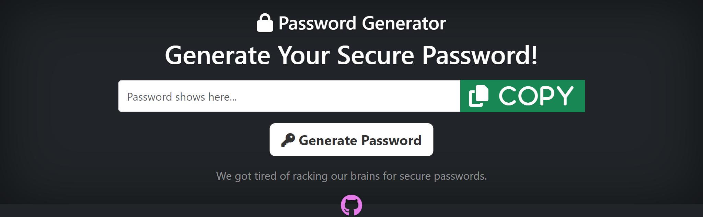

# Random-Passwords-Generator
The password generator churns out random and secure passwords that passes whatever password strength tests many of these websites are deploying. I'm definitely not the only one who is tired of racking his head for new passwords everytime you are signing up on new websites.
You can always use it offline to create new passwords. It's that easy. 

Screenshot

